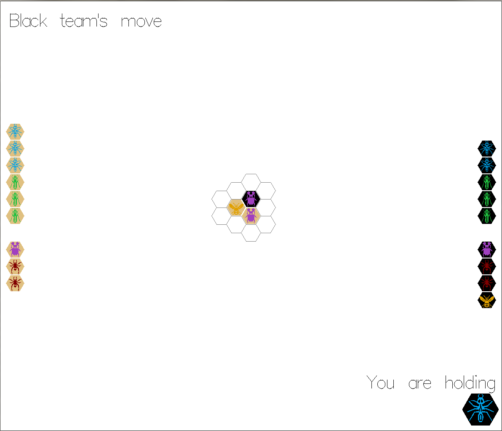

# hive

[](https://travis-ci.org/cmc-haskell-2018/hive)

Игра «Улей».

## Сборка и запуск

Соберите проект при помощи [утилиты Stack](https://www.haskellstack.org):

```
stack setup
stack build
```

Собрать и запустить проект можно при помощи команды

```
stack build && stack exec hive
```

Запустить тесты можно при помощи команды

```
stack test
```

Чтобы запустить интепретатор GHCi и автоматически подгрузить все модули проекта, используйте команду

```
stack ghci
```


## Куда тыкать, чтобы заработало

Нажмите левой кнопкой мыши на фишку, чтобы поднять ее, и на пустую клетку – чтобы поставить.
Если вы хотите выбрать другую фишку для хода, нажмите правую кнопку мыши.

Если фишка поднята, на поле изображаются возможные ходы для нее. Сама фишка рисуется в нижнем углу экрана.

В левом верхнем углу написано, чей сейчас ход. Нельзя взять фишку, цвет которой не соответствует текущему игроку.
Если игра завершилась победой одного из игроков или ничьей, надпись об этом также будет располагаться в левом верхнем углу.

Согласно правилам игры, пчела должна быть поставлена на поле не позже четвертого хода. Если до этого момента пчела не введена в игру, вы будете обязаны ходить ею.

